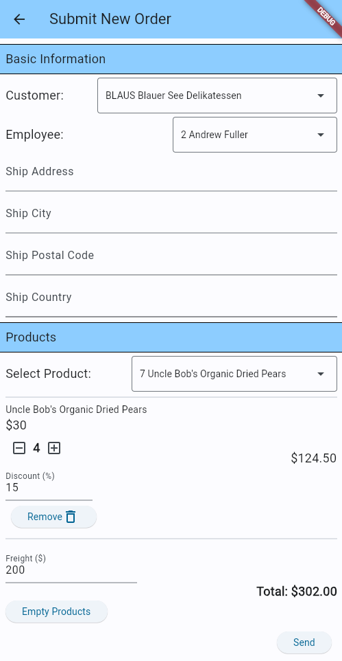

# Northwind Traders App

Mobile Flutter Project for [Saranen](https://www.saranen.fi/) Code Bootcamp.

Created in 5 days.

## GENERAL:

-   CRUD application that lets you view, create and delete Orders for fictional Northwind Traders company.
-   Uses Microsoft's [Northwind](https://github.com/Microsoft/sql-server-samples/tree/master/samples/databases/northwind-pubs) Practice SQL Database.
-   Follows MVC pattern. Uses Controller class that takes in Model type and infers routes from  Model Name.
-   Android & Web App 
-   [Backend](https://github.com/jyritasa/NorthWindTradersApi)

# PROJECT GOALS:
-   Learn C# / .NET WebApi, EntityFramework Core
-   Get better grasp with Generic Classes with Dart
-   Produce Quality Reuseable Widgets, Classes and Components.

## Screenshots:
   
   
  

## TODO:

-   Add Order Editing.